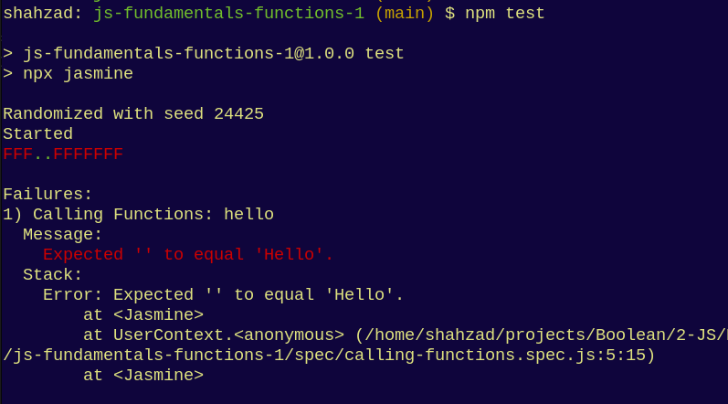

# Programming Fundamentals: Functions 1

## Learning Objectives

- Call functions to run the code in them and get the `return` value as a result
- Create functions that take a single parameter
- Create functions that take multiple parameters

## Introduction

In this exercise you will first call some predefined functions and then create your own functions that must `return` a value based on the function requirements and the parameters supplied to the function

## Setup

- Fork this repository and clone your forked version to your machine
- Install dependencies by running the command below while in the project's root directory:

    `npm ci`

## Instructions

- Read through the numbered comments in the following files to understand the requirements of this exercise.
  - `src/calling-functions.js`
  - `src/creating-functions.js`
  - `src/creating-functions-multiple-args.js`

- Write your code directly below the numbered comment.

- Add `console.log()`s to get visibility on your solution and run the file with the command `node src/calling-functions.js` *etc*

- See `src/example.js` for some example functions

## Running tests

- To verify your solutions, run the test suite by running the `npx jasmine` command followed by the path to the corresponding test file for each `src/.js` file above, eg:

    `npx jasmine spec/calling-functions.spec.js`

- Alternatively, run `npm test`

- To begin with, almost all of the tests will fail - only the example tests will pass with a green `.`. You'll see many red `F`s in your console, like the image below:

  

- Your solution is complete when the all the red `F`s have been replaced with green `.`s in your console
